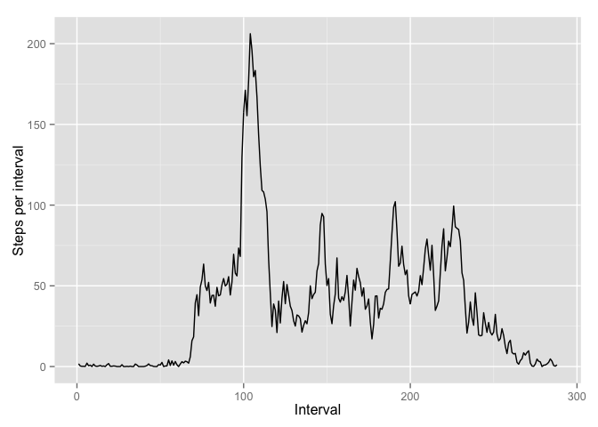

# Reproducible Research: Peer Assessment 1
created by Orlov Andrey (a.k.a @lokaro)  


## Loading and preprocessing the data
First of all, we will load data by using `read.csv(...)` and translate string of format **2012-10-01** to date

```r
data = read.csv(file = "activity.csv", header = TRUE, sep = ",")
data$date <- as.Date(data$date, "%Y-%m-%d")
```
Also, let's check `str` of our dataset

```r
str(data)
```

```
## 'data.frame':	17568 obs. of  3 variables:
##  $ steps   : int  NA NA NA NA NA NA NA NA NA NA ...
##  $ date    : Date, format: "2012-10-01" "2012-10-01" ...
##  $ interval: int  0 5 10 15 20 25 30 35 40 45 ...
```

## What is mean total number of steps taken per day?


Now, we should prepare data and aggregate all steps per date and build graphs:
 

We can see, that there are days without activity or it's very small!

Let's calculate mean of steps taken per day

```r
meanRes <- as.integer(mean(stepPerDay))
medianRes <- as.integer(median(stepPerDay))
```

The result is:

* Mean = 9354
* Median = 10395

## What is the average daily activity pattern?

Let's check activity through intervals. Here we will create sequence `intervals` for correct chart. If we get data **as is**, we will have error, because intervals have breaks between xx55 and xx00. 

```r
stepPerIntervals <- tapply(data$steps, data$interval, mean, na.rm = TRUE)
intervals <- seq(1,288)
```

And draw it!
 


```r
maxInterval <- which.max(stepPerIntervals)
intervalValue <- names(stepPerIntervals[maxInterval])
stringIntervalValue <- ""
if (nchar(intervalValue) == 3) {
  stringIntervalValue <- paste(substr(intervalValue, 1,1), substr(intervalValue, 2,3), sep = ":")
} else {
  stringIntervalValue <- paste(substr(intervalValue, 1,2), substr(intervalValue, 3,4), sep = ":")
}
```

Here we can see, that peek of activity is in the morning. And maximum activity is in 8:35


## Imputing missing values
Now, let's calculate all NAs values in dataset.

```r
nas <- length(which(is.na(data$steps)))
```

Number of missing values is **2304**.
Now, we are going to fill all this NAs values by mean values for this interval from previous step.

```r
newSteps <- numeric()
intervals <- unique(data$interval)
for (i in 1:nrow(data)) {
    tmp <- data[i, ]
    if (is.na(tmp$steps)) {
        index <- match(tmp$interval, intervals)
        steps <- stepPerIntervals[[index]]
    } else {
        steps <- tmp$steps
    }
    newSteps <- c(newSteps, steps)
}
newData <- data
newData$steps <- newSteps
```

And now we build new chart and calculate new **mean** and **median**

 


```r
newmeanRes <- as.integer(mean(newStepPerDay))
newmedianRes <- as.integer(median(newStepPerDay))
```

The new results are:

* Mean = 10766
* Median = 10766


## Are there differences in activity patterns between weekdays and weekends?
In the end, we will build new factor, which we added to our data frame and draw a chart.

```r
weekends <- ifelse (weekdays(newData$date) %in% c('Saturday', 'Sunday'),  "weekend", "weekday")
newData[, "day"] <- weekends
aggregateNewData <- aggregate(steps ~ interval + day, data=newData, mean)
g <- ggplot(aggregateNewData, aes(interval, steps))
g + geom_line() + facet_grid(day ~ .) + xlab("Intervals") + ylab("Steps")
```

 


